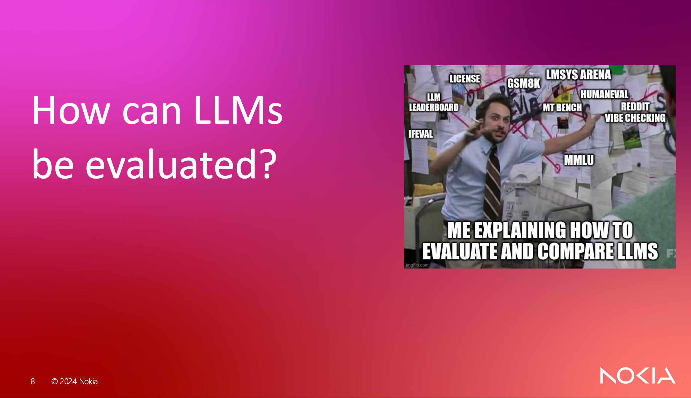

# LLM-Evaluation-Pipeline-Nokia-Master-Thesis

This repo contains my thesis work, developed during my experience in [Nokia](https://www.nokia.com/).\
The thesis title is: *__"Evaluating Large Language Models for Retrieval-Augmented Generation in Enterprise Applications. An Evaluation Pipeline for Nokia's Network as Code SDK Documentation Assistant"__*

You can find the full thesis [here](docs/Master_thesis_Canova_Tommaso.pdf), and the slides [here](docs/slides/Thesis%20presentation%20.pdf).

If you wanna find an answer for the following question
\
you will probably want to check out the [slides](docs/slides/Thesis%20presentation%20.pdf)! 🤓